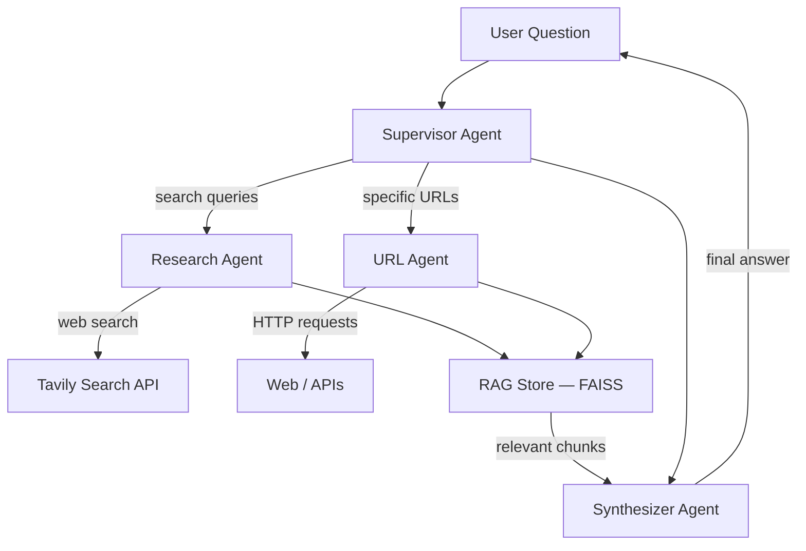

# Pyxon AI — Multi-Agent System

A production-grade multi-agent AI system that uses web search, URL fetching, and LLM reasoning to answer questions.


---

## Features

- **Search Agent** — Tavily web search + Groq Llama 3.3 70B for grounded answers with citations
- **URL/API Agent** — httpx streaming + trafilatura extraction for any web page or JSON API
- **Multi-Agent Swarm** — LangGraph supervisor pattern that routes queries to the right specialist
- **RAG Integration** — FAISS vector store + HuggingFace embeddings for retrieval-augmented synthesis
- **Test Suite** — 15 pytest cases with mocked externals (no API keys needed)
- **Docker + Docker Compose** — Multi-stage build, non-root user, ready to run
- **Kubernetes Helm Chart** — Deployment, ConfigMap, Secret, readiness probe

---

## Architecture



The **supervisor** receives a user question and routes it to the appropriate specialist: the **research agent** for web search queries, or the **URL agent** for specific URLs and APIs. After data collection, findings are optionally indexed in a **FAISS vector store** (RAG) for relevance ranking. The **synthesizer agent** then produces a polished, cited final answer from all collected data.

---

## Quick Start

```bash
# 1. Clone
git clone https://github.com/zain-codes/pyxon-ai-senior-task-Tarek-Zain.git
cd pyxon-ai-senior-task-Tarek-Zain

# 2. Set up secrets (place .env.local, then pull from AWS Secrets Manager)
cp .env.local.example .env.local
# Fill in the AWS credentials (provided separately)
python setup_env.py

# 3. Build and run
docker compose build
docker compose run agent python main.py

# 4. Or run in interactive mode
docker compose run agent python main.py --interactive
```

> **Secrets are managed via AWS Secrets Manager.** The `setup_env.py` script reads AWS credentials from `.env.local` (provided separately, never committed), fetches the application API keys, and writes them to `.env`.
>
> **Prefer manual setup?** `cp .env.example .env` and edit with your own API keys (see [Environment Variables](#environment-variables)).

---

## Environment Variables

| Variable | Required | Default | Description |
|----------|----------|---------|-------------|
| `GROQ_API_KEY` | Yes | — | Get free at [console.groq.com](https://console.groq.com/keys) |
| `TAVILY_API_KEY` | Yes | — | Get free at [tavily.com](https://app.tavily.com) |
| `MODEL_NAME` | No | `llama-3.3-70b-versatile` | Groq-hosted model identifier |
| `SEARCH_MAX_RESULTS` | No | `5` | Max search results per query (1–20) |
| `URL_FETCH_TIMEOUT` | No | `10` | HTTP request timeout in seconds |
| `URL_FETCH_MAX_SIZE` | No | `51200` | Max response body size in bytes |
| `RAG_ENABLED` | No | `true` | Enable FAISS RAG pipeline |
| `EMBEDDING_MODEL` | No | `all-MiniLM-L6-v2` | HuggingFace embedding model |
| `LOG_LEVEL` | No | `INFO` | Logging level |

---

## Project Structure

```
pyxon-ai-senior-task-Tarek-Zain/
├── main.py                          # End-to-end demo script (entry point)
├── requirements.txt                 # Python dependencies
├── requirements.lock                # Pinned versions for Docker builds
├── setup_env.py                     # Pull secrets from AWS Secrets Manager
├── Dockerfile                       # Multi-stage Docker build
├── docker-compose.yml               # Single-command container orchestration
├── .env.example                     # Environment variable template
├── .env.local.example               # AWS credentials template (for setup_env.py)
│
├── src/
│   ├── config/
│   │   ├── settings.py              # Pydantic-settings configuration
│   │   └── logging.py               # Structlog structured logging
│   ├── tools/
│   │   ├── search_tool.py           # Tavily web search tool
│   │   └── url_fetch_tool.py        # httpx URL fetch + content extraction
│   ├── agents/
│   │   ├── search_agent.py          # Standalone search agent (ReAct)
│   │   ├── url_agent.py             # Standalone URL agent (ReAct)
│   │   └── synthesizer.py           # Tool-less synthesis agent
│   ├── swarm/
│   │   └── supervisor.py            # LangGraph supervisor orchestrator
│   └── rag/
│       └── vectorstore.py           # FAISS vector store for RAG
│
├── tests/
│   ├── conftest.py                  # Shared fixtures (fake API keys)
│   ├── test_tools.py                # Tool unit tests (7 cases)
│   ├── test_agents.py               # Agent creation tests (3 cases)
│   └── test_benchmark.py            # Parametrized benchmark tests (5 cases)
│
└── k8s/                             # Helm chart
    ├── Chart.yaml
    ├── values.yaml
    └── templates/
        ├── deployment.yaml           # Pod spec with security context
        ├── service.yaml              # ClusterIP service
        ├── configmap.yaml            # Non-secret configuration
        └── secret.yaml               # API keys (base64)
```

---

## Example Output

Running `python main.py` produces output like this:

```
============================================================
  Pyxon AI — Multi-Agent System Demo
============================================================

--- DEMO 1: Search Agent (Tavily + Groq) ---
Question: What are the latest developments in AI regulation?

Answer:
## AI Regulation Developments

The global AI regulatory landscape is evolving rapidly ...
[Search results with citations like [Source Title](URL)]

--- DEMO 2: URL Agent (httpx + trafilatura) ---
Question: What does https://jsonplaceholder.typicode.com/posts/1 return?

Answer:
The API endpoint returns a JSON object representing a blog post:
{
  "userId": 1,
  "id": 1,
  "title": "sunt aut facere ...",
  "body": "quia et suscipit ..."
}
...

--- DEMO 3: Multi-Agent Swarm (supervisor + RAG) ---
Question: What is LangGraph, what problem does it solve, and how does it
compare to other agent frameworks?

Answer:
## Answer
LangGraph is an open-source framework developed by LangChain that enables
the creation and management of AI agent workflows by combining large language
models (LLMs) with graph-based architectures ...
[Supervisor routes to research_agent → RAG indexes findings → synthesizer
produces cited answer]

## Sources
- [What is LangGraph? - GeeksforGeeks](https://www.geeksforgeeks.org/...)
- [What is LangGraph? - IBM](https://www.ibm.com/think/topics/langgraph)
- ...

============================================================
  All demos completed successfully!
============================================================
```

---

## Design Decisions

| Decision | Rationale |
|----------|-----------|
| **Groq (Llama 3.3 70B)** | Fastest free-tier LLM inference. Llama 3.3 70B provides strong reasoning for agent routing and synthesis. |
| **Tavily** | Purpose-built for AI agents. Returns LLM-ready snippets with citations, unlike raw Google results that need HTML parsing. |
| **LangGraph Supervisor** | Enterprise-grade multi-agent orchestration with explicit state management and handoff control via `langgraph-supervisor`. |
| **FAISS** | Zero infrastructure cost, runs locally, battle-tested by Meta for billion-scale vector search. |
| **httpx streaming** | Enforces size limits without downloading entire responses. Prevents memory exhaustion from unbounded downloads. |
| **trafilatura** | Extracts clean article text from HTML, removing navigation/ads/scripts. BeautifulSoup as fallback. |
| **pydantic-settings** | Runtime validation of environment variables at startup — missing keys fail fast with clear errors. |

---

## Security Notes

- All API keys loaded from environment variables via pydantic-settings (never hardcoded).
- URL fetching includes configurable timeouts, response size limits, and graceful error handling.
- Docker image runs as non-root user (`appuser:1000`).
- Helm chart uses Kubernetes Secrets for API keys (not ConfigMaps).
- In production: add domain allowlisting, rate limiting, and audit logging.

---

## Testing

```bash
# Run all tests (no API keys needed — everything is mocked)
pytest tests/ -v
```

The test suite includes:
- **7 tool tests** — search tool (results, errors, empty) + URL tool (JSON, HTML, timeout, truncation)
- **3 agent tests** — search agent, URL agent, and swarm creation validation
- **5 benchmark tests** — parametrized end-to-end cases with keyword assertions

---

## Docker

```bash
# Pull secrets (skip if you already have a .env file)
python setup_env.py   # reads .env.local → fetches from AWS SM → writes .env

# Build and run
docker compose build
docker compose run agent python main.py
docker compose run agent python main.py --interactive
```

> **Note:** Tests are run locally (`pytest tests/ -v`), not inside the container.
> The Docker image contains only production code for a smaller image size.

---

## Deployment (Helm Chart)

The `k8s/` directory contains a Helm chart for Kubernetes deployment:

```bash
# Validate the chart
helm lint k8s/

# Dry-run to inspect rendered templates
helm install pyxon-ai k8s/ --dry-run --debug

# Deploy (replace with your real base64-encoded API keys)
helm install pyxon-ai k8s/ \
  --set-string secrets.GROQ_API_KEY=$(echo -n $GROQ_API_KEY | base64) \
  --set-string secrets.TAVILY_API_KEY=$(echo -n $TAVILY_API_KEY | base64)
```

The deployment includes:
- **Security context**: `runAsNonRoot`, UID 1000
- **Readiness probe**: verifies the Python application can import successfully
- **Resource limits**: 1 CPU / 2Gi memory (configurable in `values.yaml`)
